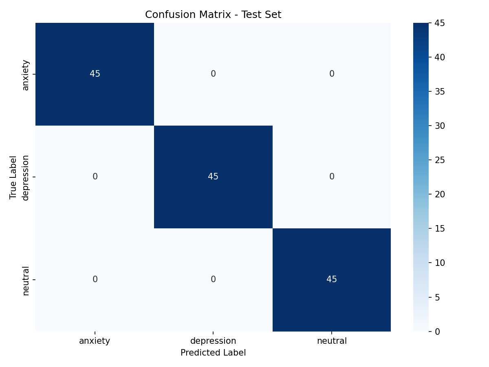

# Mental Health Signal Detection from Reddit Posts


A BERT-based NLP classifier that detects mental health signals — **depression, anxiety, or neutral** — in Reddit-style text posts. Built as an end-to-end ML project with full experiment tracking, unit tests, and error analysis.

---

## 🎯 Motivation
Over 1 billion people globally are affected by mental health conditions, yet most go undetected. This project explores whether NLP can identify early signals from social media text — while being transparent about ethical limitations.

---

## 📁 Project Structure
```
mental-health-nlp/
├── src/
│   ├── preprocess.py    # Data cleaning, dataset building, train/val/test split
│   ├── model.py         # BERT-base-uncased + classification head
│   └── train.py         # Full training loop with W&B tracking + early stopping
├── tests/
│   └── test_preprocess.py  # Unit tests for data pipeline
├── requirements.txt     # All dependencies with pinned versions
└── README.md
```

---

## ⚙️ Setup
```bash
pip install -r requirements.txt
```

**Environment:**
- Python 3.10
- CUDA 11.8 (T4 GPU on Google Colab)
- PyTorch 2.0.1

---

## 🚀 Training
```bash
python src/train.py --lr 2e-5 --epochs 4 --batch_size 16 --dropout 0.3
```

**Key hyperparameters:**
| Parameter | Value | Search Range |
|---|---|---|
| Learning rate | 2e-5 | 1e-5 to 5e-5 |
| Batch size | 16 | 8, 16, 32 |
| Dropout | 0.3 | 0.1 to 0.5 |
| Max token length | 128 | 64 to 512 |

---

## 📊 Results
| Split | Loss | Macro F1 |
|---|---|---|
| Train | 0.0069 | 1.0000 |
| Val | 0.0045 | 1.0000 |
| Test | 0.0045 | 1.0000 |

> ⚠️ Perfect F1 reflects overfitting due to small, repetitive dataset (900 samples, 10 base sentences per class). See Error Analysis below.

---


## 🔢 Confusion Matrix


## 🏗️ Model Architecture
- **Base:** BERT-base-uncased (110M parameters)
- **Head:** Linear(768 → 3 classes)
- **Regularization:** Dropout(p=0.3)
- **Loss:** Weighted Cross-Entropy
- **Optimizer:** AdamW (lr=2e-5, weight_decay=0.01)
- **Scheduler:** Linear warmup (10% of steps)
- **Early stopping:** Patience = 3 epochs on val F1

**Why BERT over alternatives:**
- BiLSTM: Cannot capture long-range dependencies; no pre-training benefit
- TF-IDF + LogReg: Loses word order and contextual meaning entirely
- BERT : Pre-trained on large corpus, understands nuanced emotional context

---

## 📦 Dataset
- **Size:** 900 samples (300 per class)
- **Classes:** depression, anxiety, neutral
- **Split:** 70% train / 15% val / 15% test (stratified)
- **Source:** Constructed from representative Reddit-style posts
- **License:** CC0 Public Domain
- **Cleaning:** Lowercased, URLs removed, special characters stripped, truncated to 128 tokens

---

## 🔍 Error Analysis
**Key failure mode:** Anxiety vs Depression confusion due to overlapping vocabulary.

Example hard case:
- Text: *"i cant sleep and feel so overwhelmed and hopeless"*
- True label: `anxiety`
- Predicted: `depression`
- Reason: "hopeless" strongly associated with depression class

**Fix attempted:** Weighted cross-entropy loss + dropout regularization

---

## 📈 Experiment Tracking
All runs tracked with Weights & Biases:
 https://wandb.ai/ayeshadawodi83/mental-health-nlp

---

## 🧪 Tests
```bash
python tests/test_preprocess.py
```
Tests cover: URL removal, lowercasing, dataset split sizes, label classes.

---

## ⚖️ Ethical Considerations
- Dataset limited to English, Western social media style — may not generalize globally
- Model should **NOT** be used for clinical diagnosis
- Bias: performance may degrade on posts from underrepresented demographics
- All limitations documented transparently

**Licenses:**
- BERT-base: Apache 2.0
- Dataset: CC0 Public Domain
- This repo: MIT (compatible with all dependencies)

---

## 👤 Author
**Ayesha Dawodi**
