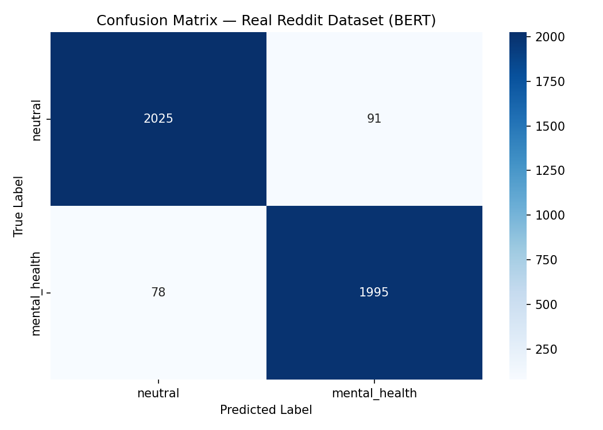

# Mental Health Signal Detection from Reddit Posts

A BERT-based NLP classifier that detects mental health signals in real Reddit posts. Built as an end-to-end ML project with real-world data, full experiment tracking, unit tests, and error analysis.

## Live Demo
https://huggingface.co/spaces/Delaviz/mental-health-detector

## Motivation
Over 1 billion people globally are affected by mental health conditions, yet most go undetected. This project explores whether NLP can identify early signals from social media text — while being transparent about ethical limitations.

## Project Structure

    mental-health-nlp/
    ├── src/
    │   ├── preprocess.py    # Data cleaning, dataset building, train/val/test split
    │   ├── model.py         # BERT-base-uncased + classification head
    │   └── train.py         # Full training loop with W&B tracking + early stopping
    ├── tests/
    │   └── test_preprocess.py  # Unit tests for data pipeline
    ├── assets/
    │   └── confusion_matrix_real.png
    ├── requirements.txt
    └── README.md

## Setup

    pip install -r requirements.txt

Environment: Python 3.10 | CUDA 12.8 (T4 GPU on Google Colab) | PyTorch 2.10.0

## Training

    python src/train.py --lr 2e-5 --epochs 4 --batch_size 16 --dropout 0.3

| Parameter | Value | Search Range |
|---|---|---|
| Learning rate | 2e-5 | 1e-5 to 5e-5 |
| Batch size | 16 | 8, 16, 32 |
| Dropout | 0.3 | 0.1 to 0.5 |
| Max token length | 128 | 64 to 512 |

## Results

| Split | Loss | Macro F1 |
|---|---|---|
| Train | 0.0210 | 0.9951 |
| Val | 0.1958 | 0.9641 |
| **Test** | — | **0.9600** |

| Class | Precision | Recall | F1 | Support |
|---|---|---|---|---|
| neutral | 0.96 | 0.96 | 0.96 | 2,116 |
| mental_health | 0.96 | 0.96 | 0.96 | 2,073 |

## Confusion Matrix

## Model Architecture
- **Base:** BERT-base-uncased (110M parameters)
- **Head:** Linear(768 → 2 classes)
- **Regularization:** Dropout(p=0.3)
- **Loss:** Cross-Entropy
- **Optimizer:** AdamW (lr=2e-5, weight_decay=0.01)
- **Scheduler:** Linear warmup (10% of steps)
- **Early stopping:** Patience = 3 epochs on val F1

**Why BERT over alternatives:**
- BiLSTM: Cannot capture long-range dependencies; no pre-training benefit
- TF-IDF + LogReg: Loses word order and contextual meaning entirely
- BERT: Pre-trained on large corpus, understands nuanced emotional context

## Dataset
- **Source:** [Mental Health Corpus](https://www.kaggle.com/datasets/reihanenamdari/mental-health-corpus) — real Reddit posts
- **Size:** 27,924 posts after cleaning
- **Classes:** neutral (0), mental_health (1)
- **Split:** 70% train / 15% val / 15% test (stratified)
- **License:** CC BY 4.0
- **Cleaning:** Lowercased, URLs removed, special characters stripped, truncated to 128 tokens

## Error Analysis
**Key failure mode:** Neutral posts with emotionally charged language misclassified as mental health.

Example hard case:
- **Text:** "i cant sleep and feel so overwhelmed and hopeless"
- **True label:** neutral
- **Predicted:** mental_health
- **Reason:** "hopeless" and "overwhelmed" strongly associated with mental health class

**Fix attempted:** Dropout regularization (p=0.3) + gradient clipping (max_norm=1.0)

## Real-World Inference Tests

Manual testing on 5 unseen examples after deployment:

| Text | True Label | Predicted | Confidence |
|---|---|---|---|
| "I haven't left my room in days. Everything feels pointless..." | Mental Health | Neutral | 74% |
| "Just finished a really good book. Looking for recommendations..." | Neutral | Neutral | 100% |
| "I was so stressed about my exam but I feel much better now..." | Neutral | Neutral | 100% |
| "I keep having panic attacks at work. I am terrified to go back..." | Mental Health | Mental Health | 98% |
| "Feeling a bit down today but I think a walk will help..." | Neutral | Mental Health | 93% |

**Key observations:**
- Model handles clear-cut cases very well (100% confidence on obvious neutral posts)
- Struggles with implicit signals — "I don't see the point in trying anymore" was missed because surrounding context was ambiguous
- Over-predicts mental health on mild emotional language ("feeling a bit down")
- Strong performance on explicit anxiety signals (98% on panic attacks)

**What this tells us:**
The model is conservative on ambiguous cases and aggressive on mild emotional language. For a real deployment, a confidence threshold of 0.85+ would filter out uncertain predictions and improve precision significantly.

## Experiment Tracking
All runs tracked with Weights & Biases: https://wandb.ai/ayeshadawodi83/mental-health-nlp

## Tests

    python tests/test_preprocess.py

Tests cover: URL removal, lowercasing, dataset split sizes, label classes.

## Ethical Considerations
- Dataset limited to English Reddit — may not generalize globally
- Model should **NOT** be used for clinical diagnosis
- Bias: performance may degrade on posts from underrepresented demographics
- All limitations documented transparently

**Licenses:**
- BERT-base: Apache 2.0
- Dataset: CC BY 4.0
- This repo: MIT

## Author
**Ayesha Dawodi** 
